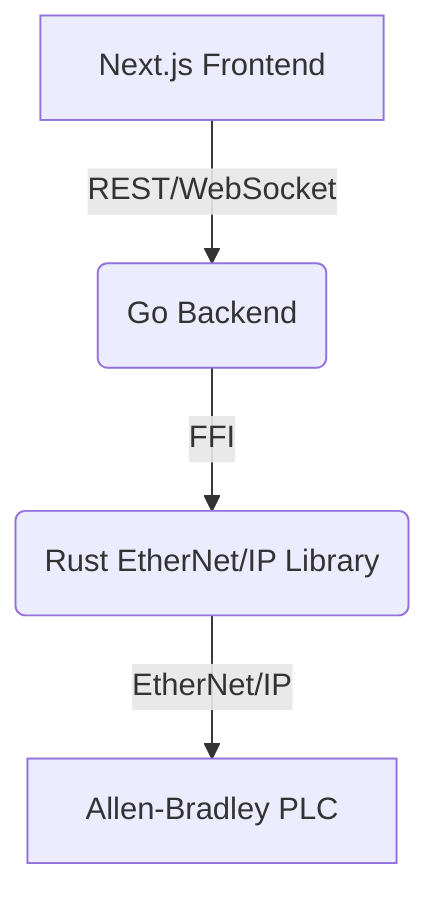

# 🦀 Rust EtherNet/IP Go + Next.js Fullstack Example

A modern, production-ready fullstack EtherNet/IP demo using a **Go backend** (with the Rust Go wrapper) and a **Next.js (TypeScript) frontend**.  
This example demonstrates high-performance PLC communication, batch operations, real-time updates, and a beautiful web UI—mirroring the features of the classic ASP.NET + React sample.

---

## 🎯 Features

- **Go backend** using the Rust EtherNet/IP Go wrapper (FFI)
- **Next.js frontend** (TypeScript, Tailwind, App Router)
- **Batch read/write** and individual tag operations
- **Performance benchmarking** (ops/sec, latency)
- **Real-time tag updates** via WebSocket
- **Comprehensive PLC data type support**
- **Modern, responsive UI**

---

## 🏗️ Architecture


```

---

## 🚀 Quick Start

### Prerequisites

- Go 1.21+ (CGO enabled)
- Node.js 18+
- Rust toolchain (for building the shared library)
- Allen-Bradley PLC (CompactLogix/ControlLogix) or simulator

### 1. Build the Rust library

```bash
cd <project-root>
cargo build --release --features ffi
```

### 2. Start the Go backend

```bash
cd examples/gonextjs/backend
go run .
# Backend runs on http://localhost:8080
```

### 3. Start the Next.js frontend

```bash
cd ../frontend
npm install
npm run dev
# Frontend runs on http://localhost:3000
```

### 4. Connect and Explore

- Open [http://localhost:3000](http://localhost:3000)
- Enter your PLC IP (e.g., `192.168.0.1:44818`)
- Use the UI for individual, batch, and performance operations

---

## 🛠️ Backend API

- `POST /api/connect` — Connect to PLC
- `POST /api/disconnect` — Disconnect
- `GET/POST /api/tag` — Read/write single tag
- `POST /api/batch` — Batch read/write
- `GET /api/taginfo` — Discover tag type
- `GET /api/test-read` — Debug read
- `POST /api/benchmark` — Run performance test
- `GET /ws` — WebSocket for real-time updates

See [`backend/README.md`](./backend/README.md) for details.

---

## 🎮 Frontend UI

- **Tabs:** Individual, Batch, Performance, Config
- **Batch format:**  
  - Read: `TagName:Type` (one per line)  
  - Write: `TagName:Type=Value` (one per line)
- **Live activity log** and performance stats

See [`frontend/README.md`](./frontend/README.md) for details.

---

## 🧩 Go Wrapper

- Uses the [gowrapper](../../gowrapper/README.md) for high-performance, type-safe PLC access from Go.
- Supports all major Allen-Bradley types.

---

## 🐞 Troubleshooting

- Ensure the Rust DLL/SO/DYLIB is in the backend directory or on your system path.
- PLC must be reachable from your machine.
- For Go module issues, run `go mod tidy` in `backend/`.

---

## 📚 More Info

- [gowrapper/README.md](../../gowrapper/README.md) — Go FFI wrapper details
- [Project root README](../../README.md) — Rust library, C#, and more

---

## License

MIT 